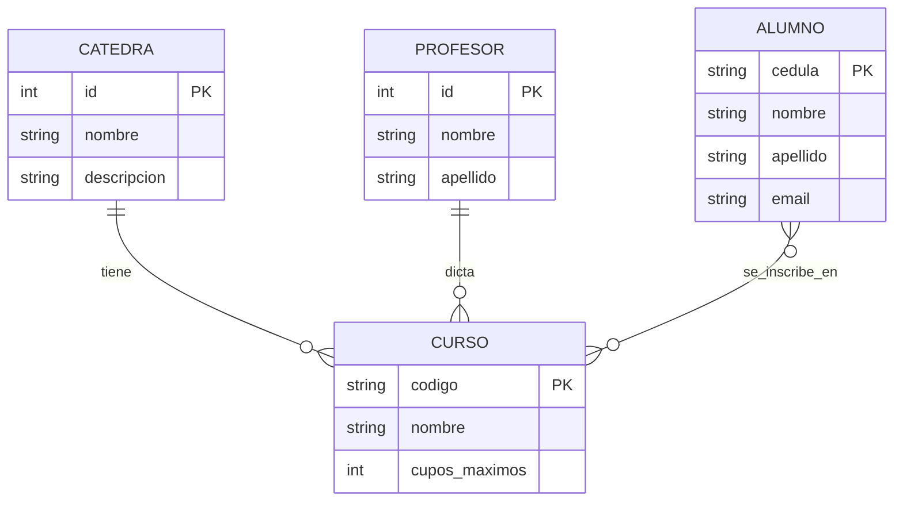
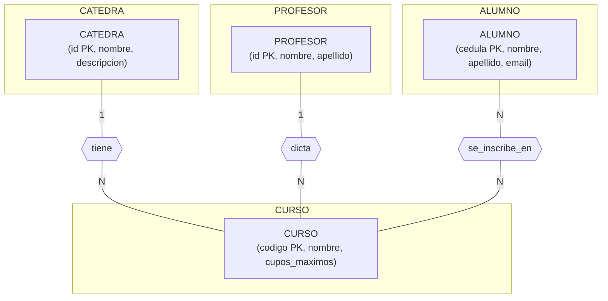

# 02.1 — Introducción al Modelo Entidad–Relación (E‑R) - Inscripciones 
*Modelo conceptual para un sistema simple de inscripciones*

En esta sesión trabajaremos con un ejemplo sencillo pero muy realista:  
un **sistema de inscripciones** donde intervienen **cátedras, cursos, alumnos y profesores**.

Nuestro objetivo no es modelar toda la universidad (facultades, edificios, horarios, etc.), sino construir un **modelo conceptual claro y manejable** que nos permita comprender cómo identificar entidades, atributos y relaciones, y cómo expresar cardinalidades y restricciones básicas.

No usaremos otras entidades como *Facultad*, *Escuela* o *Departamento* porque, en esta etapa, queremos concentrarnos en lo esencial.

---

## 1. Entidades identificadas

Partimos del enunciado del negocio:

- Hay **cátedras** que agrupan cursos.
- Hay **cursos** que pertenecen a una cátedra y son dictados por un profesor.
- Hay **profesores** que dictan uno o varios cursos.
- Hay **alumnos** que se inscriben en varios cursos.

Las entidades principales son:

### Cátedra
Representa un área académica o unidad temática.

### Curso
Asignatura específica impartida dentro de una cátedra.

### Profesor
Persona que dicta uno o varios cursos.

### Alumno
Estudiante que se inscribe en uno o varios cursos.

---

## 2. Atributos de cada entidad

### Cátedra
- id_catedra  
- nombre  
- descripcion  

### Profesor
- id_profesor  
- nombre  
- apellido  
- email  

### Curso
- id_curso  
- codigo  
- nombre  
- cupos_maximos  

### Alumno
- id_alumno  
- cedula  
- nombre  
- apellido  
- email  

---

## 3. Relaciones del modelo

### Profesor dicta Curso
Un profesor puede dictar varios cursos.  
Cada curso tiene un profesor asignado.

### Cátedra tiene Curso
Una cátedra puede tener varios cursos.  
Cada curso pertenece a una sola cátedra.

### Alumno se inscribe en Curso
Un alumno puede inscribirse en varios cursos.  
Un curso puede tener varios alumnos.

---

## 4. Cardinalidades y participación

### Profesor — Curso
- Profesor → Curso: (0,n)  
- Curso → Profesor: (1,1)  
- Participación: Profesor parcial, Curso total.

### Cátedra — Curso
- Cátedra → Curso: (0,n)  
- Curso → Cátedra: (1,1)  
- Participación: Cátedra parcial, Curso total.

### Alumno — Curso
- Alumno ↔ Curso: (0,n)  
- Participación: ambos parciales.

---

## 5. Restricciones conceptuales

### Claves primarias
- Cátedra: id_catedra  
- Profesor: id_profesor  
- Curso: id_curso  
- Alumno: id_alumno  

### Atributos únicos
- Profesor.email  
- Alumno.cedula  
- Alumno.email  
- Curso.codigo  

### Restricciones de valor
- cupos_maximos > 0  
- cedula no nula  
- nombre y apellido obligatorios  
- email con formato válido  

### Nulidad conceptual
- Claves primarias: no nulas  
- Atributos esenciales: no nulos  
- descripcion (cátedra): opcional  

---

## 6. Representación ASCII del modelo E‑R

```
           (1)                     (N)
[CATEDRA] ------ tiene ------ [CURSO] ------ dicta ------ [PROFESOR]
                                   |
                                   |
                                   | (N:N)
                                   |
                               se_inscribe_en
                                   |
                                   |
                               [ALUMNO]
```

### Diagrama E‑R



### Diagrama clásico E‑R



---

## 7. Resumen de la sesión

En esta sesión:

- Identificamos entidades, atributos y relaciones.  
- Definimos cardinalidades y participación.  
- Establecimos restricciones conceptuales.  
- Representamos el modelo en ASCII para GitHub.  

Este es el modelo conceptual.  
El modelo relacional (tablas, claves foráneas, tabla intermedia) vendrá después.

---


