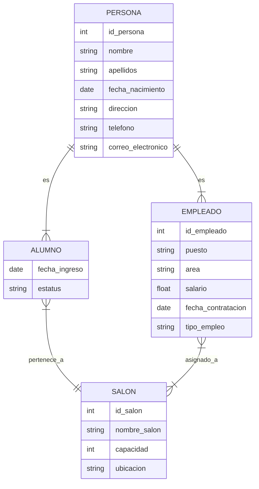

# 02.2 - MODELO ENTIDAD RELACION - EXTENSION  
Generalizacion, subtipos, relaciones con atributos y nuevos dominios

-------------------------------------------------------------------------------

# 1. MODELO CONCEPTUAL: VISION GENERAL

Este modelo representa un sistema academico basico en el que intervienen:

- Personas  
- Alumnos  
- Empleados  
- Salones  

El objetivo es mostrar como se construye un modelo conceptual antes de pasar al modelo logico o relacional.

En esta etapa conviene notar un problema frecuente en el diseno de modelos: si cada vez que aparece un nuevo tipo de participante en el sistema (por ejemplo, proveedores, contratados, tutores externos, personal temporal, visitantes, etc.) se crea una entidad independiente para cada uno, el modelo comienza a fragmentarse.

Esto genera varias dificultades:

- Atributos repetidos en multiples entidades (nombre, apellidos, telefono, correo, direccion).  
- Inconsistencias cuando un atributo comun cambia y debe actualizarse en varios lugares.  
- Crecimiento innecesario del modelo, con muchas entidades casi identicas.  
- Relaciones duplicadas hacia otras entidades del sistema.  
- Mayor complejidad al mantener y extender la base de datos.

Por eso, antes de avanzar, es importante reconocer que el modelo conceptual debe permitir agrupar lo que es comun y separar lo que es especifico. Esta necesidad es la que motiva la introduccion de mecanismos como entidades generales y entidades especializadas, que veremos en las siguientes secciones.

-------------------------------------------------------------------------------

# 2. SUPERTIPOS Y SUBTIPOS

## 2.1. PERSONA (supertipo)

Atributos sugeridos:
- id_persona  
- nombre  
- apellidos  
- fecha_nacimiento  
- direccion  
- telefono  
- correo_electronico  

## 2.2. ALUMNO (subtipo de Persona)

Atributos propios:
- fecha_ingreso  
- estatus  

## 2.3. EMPLEADO (subtipo de Persona)

Atributos propios:
- id_empleado  
- puesto  
- area  
- salario  
- fecha_contratacion  
- tipo_empleo  

## 2.4. Restricciones de especializacion

- Disjoint (D): una persona es Alumno O Empleado, pero no ambos.  
- Overlapping (O): una persona puede ser Alumno Y Empleado.  
- Total (T): toda persona debe ser Alumno o Empleado.  
- Parcial (P): puede haber personas sin subtipo asignado.  

En este modelo asumimos:
- Disjoint (D)  
- Parcial (P)  

-------------------------------------------------------------------------------

# 3. ENTIDAD SALON

Atributos sugeridos:
- id_salon  
- nombre_salon  
- capacidad  
- ubicacion  

-------------------------------------------------------------------------------

# 4. RELACIONES DEL MODELO

## 4.1. ALUMNO - SALON  
Un alumno pertenece a un salon.

Cardinalidad:
- Alumno -> Salon: (1,1)  
- Salon -> Alumno: (0,n)  

Participacion:
- Alumno: total  
- Salon: parcial  

## 4.2. EMPLEADO - SALON  
Un empleado puede estar asignado a uno o varios salones.

Cardinalidad:
- Empleado -> Salon: (0,n)  
- Salon -> Empleado: (0,n)  

Participacion:
- Ambos: parcial  

-------------------------------------------------------------------------------

# 5. RELACIONES CON ATRIBUTOS

Solo aplican cuando la relacion es N:N.

## 5.1. Alumno - Salon  
Atributos posibles:
- fecha_asignacion  
- periodo  

## 5.2. Empleado - Salon  
Atributos posibles:
- rol  
- horario  
- materia  
- grupo  

-------------------------------------------------------------------------------

# 6. REPRESENTACION ASCII DEL MODELO

Supertipo y subtipos:

```
                     [PERSONA]
     id_persona, nombre, apellidos, fecha_nacimiento,
     direccion, telefono, correo_electronico

              /                               \
             /                                 \
            /                                   \
     [ALUMNO]                                 [EMPLEADO]
  fecha_ingreso, estatus         id_empleado, puesto, area,
                                 salario, fecha_contratacion,
                                 tipo_empleo
```

Relacion Alumno - Salon:

```
            (1)                                (N)
[ALUMNO] -------- pertenece_a -------- [SALON]
                        |
                        | fecha_asignacion
                        | periodo
```

Relacion Empleado - Salon:

```
            (N)                                (N)
[EMPLEADO] ------ asignado_a ------ [SALON]
                     rol, horario, materia, grupo
```

Modelo completo:

```
                     [PERSONA]
     id_persona, nombre, apellidos, fecha_nacimiento,
     direccion, telefono, correo_electronico

              /                               \
             /                                 \
            /                                   \
     [ALUMNO]                                 [EMPLEADO]
  fecha_ingreso, estatus         id_empleado, puesto, area,
                                 salario, fecha_contratacion,
                                 tipo_empleo

            | (1)                                 | (N)
            | pertenece_a                         | asignado_a
            |                                      |
            v                                      v

                          [SALON]
           id_salon, nombre_salon, capacidad, ubicacion
```

-------------------------------------------------------------------------------

# 7. REPRESENTACION MERMAID

```

```

-------------------------------------------------------------------------------

# 8. CONCLUSION

Este capitulo introduce:

- Supertipos y subtipos  
- Relaciones con atributos  
- Nuevas cardinalidades  
- Entidades de contexto  
- Representaciones ASCII y Mermaid  

-------------------------------------------------------------------------------

# 9. MINI QUIZ

1. Que diferencia hay entre un supertipo y un subtipo  
2. Que significa que una especializacion sea disjoint  
3. Cuando una relacion puede tener atributos propios  
4. Que tipo de relacion existe entre Empleado y Salon  
5. Por que es util representar herencia en un modelo E-R  

-------------------------------------------------------------------------------

# 10. EJERCICIOS SUGERIDOS

1. Identifica 3 ejemplos de supertipos y subtipos en otros dominios  
2. Disena una relacion N:N con atributos propios  
3. Representa en ASCII un modelo con herencia  
4. Explica por que la relacion Alumno - Salon es 1:N  
5. Extiende el modelo agregando una entidad adicional sin romper la herencia  

