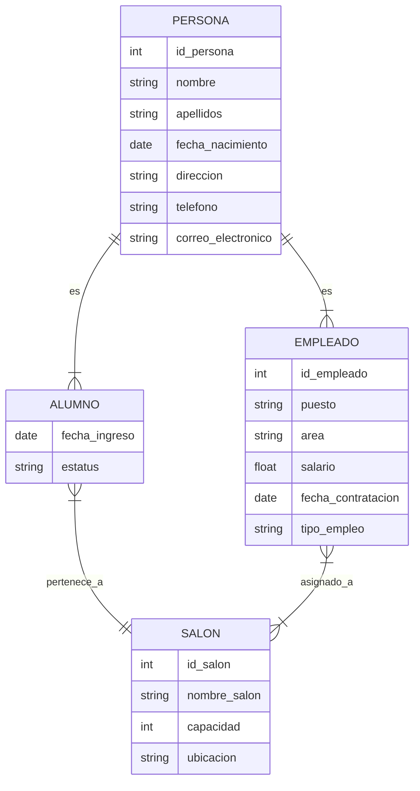

# 02.2 — Modelo Entidad–Relación (Extensión)  
Generalización, subtipos, relaciones con atributos y nuevos dominios

---

## 1. Modelo conceptual: visión general

Este modelo representa un sistema académico básico en el que intervienen:

- Personas  
- Alumnos  
- Empleados  
- Salones  

El objetivo es mostrar cómo se construye un modelo conceptual antes de pasar al modelo lógico o relacional.

En esta etapa conviene notar un problema frecuente en el diseño de modelos: si cada vez que aparece un nuevo tipo de participante en el sistema (por ejemplo, proveedores, contratados, tutores externos, personal temporal, visitantes, etc.) se crea una entidad independiente para cada uno, el modelo comienza a fragmentarse.

Esto genera varias dificultades:

- Atributos repetidos en múltiples entidades (nombre, apellidos, teléfono, correo, dirección).  
- Inconsistencias cuando un atributo común cambia y debe actualizarse en varios lugares.  
- Crecimiento innecesario del modelo, con muchas entidades casi idénticas.  
- Relaciones duplicadas hacia otras entidades del sistema.  
- Mayor complejidad al mantener y extender la base de datos.

Por eso, antes de avanzar, es importante reconocer que el modelo conceptual debe permitir **agrupar lo que es común y separar lo que es específico**. Esta necesidad es la que motiva la introducción de mecanismos como entidades generales y entidades especializadas, que veremos en las siguientes secciones.

---

## 2. Supertipos y subtipos

### 2.1. Persona (supertipo)

Atributos sugeridos:

- id_persona  
- nombre  
- apellidos  
- fecha_nacimiento  
- dirección  
- teléfono  
- correo_electrónico  

### 2.2. Alumno (subtipo de Persona)

Atributos propios:

- fecha_ingreso  
- estatus  

### 2.3. Empleado (subtipo de Persona)

Atributos propios:

- id_empleado  
- puesto  
- área  
- salario  
- fecha_contratación  
- tipo_empleo  

### 2.4. Restricciones de especialización

- **Disjoint (D):** una persona es Alumno *o* Empleado, pero no ambos.  
- **Overlapping (O):** una persona puede ser Alumno *y* Empleado.  
- **Total (T):** toda persona debe ser Alumno o Empleado.  
- **Parcial (P):** puede haber personas sin subtipo asignado.

En este modelo asumimos:

- Disjoint (D)  
- Parcial (P)

---

## 3. Entidad Salón

Atributos sugeridos:

- id_salon  
- nombre_salon  
- capacidad  
- ubicación  

---

## 4. Relaciones del modelo

### 4.1. Alumno — Salón  
Un alumno pertenece a un salón.

Cardinalidad:

- Alumno → Salón: (1,1)  
- Salón → Alumno: (0,n)

Participación:

- Alumno: total  
- Salón: parcial  

### 4.2. Empleado — Salón  
Un empleado puede estar asignado a uno o varios salones.

Cardinalidad:

- Empleado → Salón: (0,n)  
- Salón → Empleado: (0,n)

Participación:

- Ambos: parcial  

---

## 5. Relaciones con atributos

Solo aplican cuando la relación es N:N.

### 5.1. Alumno — Salón  
Atributos posibles:

- fecha_asignación  
- periodo  

### 5.2. Empleado — Salón  
Atributos posibles:

- rol  
- horario  
- materia  
- grupo  

---

## 6. Representación ASCII del modelo

### Supertipo y subtipos

```
                     [PERSONA]
     id_persona, nombre, apellidos, fecha_nacimiento,
     dirección, teléfono, correo_electrónico

              /                               \
             /                                 \
            /                                   \
     [ALUMNO]                                 [EMPLEADO]
  fecha_ingreso, estatus         id_empleado, puesto, área,
                                 salario, fecha_contratación,
                                 tipo_empleo
```

### Relación Alumno — Salón

```
            (1)                                (N)
[ALUMNO] -------- pertenece_a -------- [SALON]
                        |
                        | fecha_asignación
                        | periodo
```

### Relación Empleado — Salón

```
            (N)                                (N)
[EMPLEADO] ------ asignado_a ------ [SALON]
                     rol, horario, materia, grupo
```

### Modelo completo

```
                     [PERSONA]
     id_persona, nombre, apellidos, fecha_nacimiento,
     dirección, teléfono, correo_electrónico

              /                               \
             /                                 \
            /                                   \
     [ALUMNO]                                 [EMPLEADO]
  fecha_ingreso, estatus         id_empleado, puesto, área,
                                 salario, fecha_contratación,
                                 tipo_empleo

            | (1)                                 | (N)
            | pertenece_a                         | asignado_a
            |                                      |
            v                                      v

                          [SALON]
           id_salon, nombre_salon, capacidad, ubicación
```

---

## 7. Representación Mermaid



---

## 8. Conclusión

Este capítulo introduce:

- Supertipos y subtipos  
- Relaciones con atributos  
- Nuevas cardinalidades  
- Entidades de contexto  
- Representaciones ASCII y Mermaid  

Con esto, el estudiante puede modelar sistemas más complejos y comprender cómo el modelo conceptual sirve de base para el modelo lógico y relacional.

---

## 9. Mini‑quiz

1. ¿Qué diferencia hay entre un supertipo y un subtipo?  
2. ¿Qué significa que una especialización sea disjoint?  
3. ¿Cuándo una relación puede tener atributos propios?  
4. ¿Qué tipo de relación existe entre Empleado y Salón?  
5. ¿Por qué es útil representar herencia en un modelo E‑R?  

---

## 10. Ejercicios sugeridos

1. Identifica 3 ejemplos de supertipos y subtipos en otros dominios.  
2. Diseña una relación N:N con atributos propios.  
3. Representa en ASCII un modelo con herencia.  
4. Explica por qué la relación Alumno — Salón es 1:N.  
5. Extiende el modelo agregando una entidad adicional sin romper la herencia.  

---
