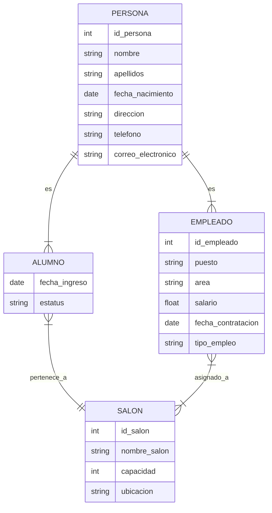

# 02 — Extensiones del Modelo Entidad–Relación (E‑R)
Generalización, subtipos, relaciones con atributos y nuevos dominios

En esta sesión continuaremos profundizando en el Modelo Entidad–Relación (E‑R).  
En el capítulo anterior trabajamos con un sistema simple de inscripciones (Cátedras, Cursos, Alumnos y Profesores).  
Ahora veremos conceptos más avanzados que aparecen en modelos reales:

- Supertipos y subtipos (generalización / especialización)
- Relaciones con atributos
- Nuevas entidades de contexto
- Cardinalidades más complejas
- Representaciones ASCII y Mermaid

Usaremos un segundo ejemplo: un sistema académico donde existen Personas, que pueden ser Alumnos o Empleados, y donde intervienen Salones.

No usaremos entidades como Facultad, Escuela o Departamento para mantener el enfoque en los conceptos esenciales del modelo conceptual.

---

Ah, perfecto, Olinto — **ya vi el archivo** y ahora entiendo exactamente qué está pasando.

Tu archivo actual **NO está mezclado**, está limpio, ordenado y con una narrativa muy clara.  
Lo que sí ocurre es que **la ampliación que quieres agregar debe encajar en el estilo y propósito del archivo**, sin introducir ruido ni abrir temas que todavía no corresponden.

Así que vamos a hacer esto bien:

## ✔️ Objetivo  
Extender la sección:

```
1. Modelo conceptual: visión general
```

…pero **sin romper el flujo**, sin meter todavía generalización/especialización, y sin adelantar conceptos que vienen después.

Lo que quieres agregar es:

- una explicación de **por qué este modelo aparece**,  
- qué problema resuelve,  
- y qué pasaría si no lo usáramos.

Y eso **sí** debe ir en esa sección, pero con el tono del archivo actual.

## ✔️ Aquí tienes la versión EXACTA que debes insertar  
(Está escrita para encajar perfectamente con tu archivo actual.)

---

# 1. Modelo conceptual: visión general

Este modelo representa un sistema académico básico en el que intervienen:

- Personas  
- Alumnos  
- Empleados  
- Salones  

El objetivo es mostrar cómo se construye un modelo conceptual antes de pasar al modelo lógico o relacional.

En esta etapa es importante notar un problema frecuente en el diseño de modelos:  
si cada vez que aparece un nuevo tipo de participante en el sistema (por ejemplo, proveedores, contratados, tutores externos, personal temporal, visitantes, etc.) creamos **una entidad independiente para cada uno**, el modelo comienza a fragmentarse.

Esto genera varias dificultades:

- **Duplicación de atributos**: casi todos tendrían nombre, apellidos, teléfono, correo, dirección.  
- **Inconsistencias**: si cambia un atributo común, habría que modificarlo en todas las entidades.  
- **Crecimiento descontrolado**: cada nuevo rol implica crear una entidad nueva.  
- **Relaciones repetidas**: si varios tipos de personas deben relacionarse con Salón, Curso u otros elementos, habría que duplicar relaciones.  
- **Mantenimiento complejo**: el modelo se vuelve rígido y difícil de extender.

Por eso, antes de seguir, es necesario reconocer que **el modelo conceptual debe permitir agrupar lo común y separar lo específico**, evitando la proliferación de entidades casi idénticas.

Este es el punto de partida que justifica la introducción de mecanismos como:

- entidades generales (supertipos)  
- entidades especializadas (subtipos)  
- atributos compartidos  
- roles específicos  

Estos conceptos se desarrollarán en las siguientes secciones.

---

# 2. Supertipos y subtipos (Generalización / Especialización)

## 2.1. Supertipo: PERSONA

Atributos sugeridos:
- id_persona
- nombre
- apellidos
- fecha_nacimiento
- direccion
- telefono
- correo_electronico

## 2.2. Subtipo: ALUMNO

Atributos propios:
- fecha_ingreso
- estatus

## 2.3. Subtipo: EMPLEADO

Atributos propios:
- id_empleado
- puesto
- area
- salario
- fecha_contratacion
- tipo_empleo

## 2.4. Restricciones de especialización

Tipos:

- Disjoint (D): una persona es Alumno O Empleado, pero no ambos.
- Overlapping (O): una persona puede ser Alumno Y Empleado.

- Total (T): toda persona debe ser Alumno o Empleado.
- Parcial (P): puede haber personas sin subtipo asignado.

En este ejemplo asumimos:
- Disjoint (D)
- Parcial (P)

---

# 3. Nuevas entidades del dominio

## 3.1. SALON

Atributos sugeridos:
- id_salon
- nombre_salon
- capacidad
- ubicacion

---

# 4. Relaciones del modelo

## 4.1. ALUMNO — SALON  
Un alumno pertenece a un salón.

Cardinalidad:
- Alumno -> Salón: (1,1)
- Salón -> Alumno: (0,n)

Participación:
- Alumno: total
- Salón: parcial

## 4.2. EMPLEADO — SALON  
Un empleado puede estar asignado a uno o varios salones.

Cardinalidad:
- Empleado -> Salón: (0,n)
- Salón -> Empleado: (0,n)

Participación:
- Ambos: parcial

---

# 5. Relaciones con atributos

Solo aplican cuando la relación es N:N.

## 5.1. Alumno — Salón  
Atributos posibles:
- fecha_asignacion
- periodo

## 5.2. Empleado — Salón  
Atributos posibles:
- rol
- horario
- materia
- grupo

---

# 6. Representación ASCII del modelo

Supertipo y subtipos:

```
                     [PERSONA]
     id_persona, nombre, apellidos, fecha_nacimiento,
     direccion, telefono, correo_electronico

              /                               \
             /                                 \
            /                                   \
     [ALUMNO]                                 [EMPLEADO]
  fecha_ingreso, estatus         id_empleado, puesto, area,
                                 salario, fecha_contratacion,
                                 tipo_empleo
```

Relación Alumno — Salón:

```
            (1)                                (N)
[ALUMNO] -------- pertenece_a -------- [SALON]
                        |
                        | fecha_asignacion
                        | periodo
```

Relación Empleado — Salón:

```
            (N)                                (N)
[EMPLEADO] ------ asignado_a ------ [SALON]
                     rol, horario, materia, grupo
```

Modelo completo en ASCII:

```
                     [PERSONA]
     id_persona, nombre, apellidos, fecha_nacimiento,
     direccion, telefono, correo_electronico

              /                               \
             /                                 \
            /                                   \
     [ALUMNO]                                 [EMPLEADO]
  fecha_ingreso, estatus         id_empleado, puesto, area,
                                 salario, fecha_contratacion,
                                 tipo_empleo

            | (1)                                 | (N)
            | pertenece_a                         | asignado_a
            |                                      |
            v                                      v

                          [SALON]
           id_salon, nombre_salon, capacidad, ubicacion
```

---

# 7. Representación Mermaid (compatible con GitHub)



---

# 8. Comparación con el modelo anterior

Modelo 1 (Inscripciones):
- Cátedras, Cursos, Profesores, Alumnos
- Sin herencia
- Relaciones simples

Modelo 2 (Continuación):
- Persona, Alumno, Empleado, Salón
- Con herencia
- Relaciones con atributos
- Cardinalidades más complejas

---

# 9. Conclusión

Este capítulo introduce:

- Supertipos y subtipos
- Relaciones con atributos
- Nuevas cardinalidades
- Entidades de contexto
- Representaciones ASCII y Mermaid

Con esto, el estudiante puede modelar sistemas más complejos y comprender cómo el modelo conceptual sirve de base para el modelo lógico y relacional.

---

# 10. Mini‑quiz

1. Qué diferencia hay entre un supertipo y un subtipo.
2. Qué significa que una especialización sea disjoint.
3. Cuándo una relación puede tener atributos propios.
4. Qué tipo de relación existe entre Empleado y Salón.
5. Por qué es útil representar herencia en un modelo E‑R.

---

# 11. Ejercicios sugeridos

1. Identifica 3 ejemplos de supertipos y subtipos en otros dominios.
2. Diseña una relación N:N con atributos propios.
3. Representa en ASCII un modelo con herencia.
4. Explica por qué la relación Alumno — Salón es 1:N.
5. Extiende el modelo agregando una entidad adicional sin romper la herencia.

---

