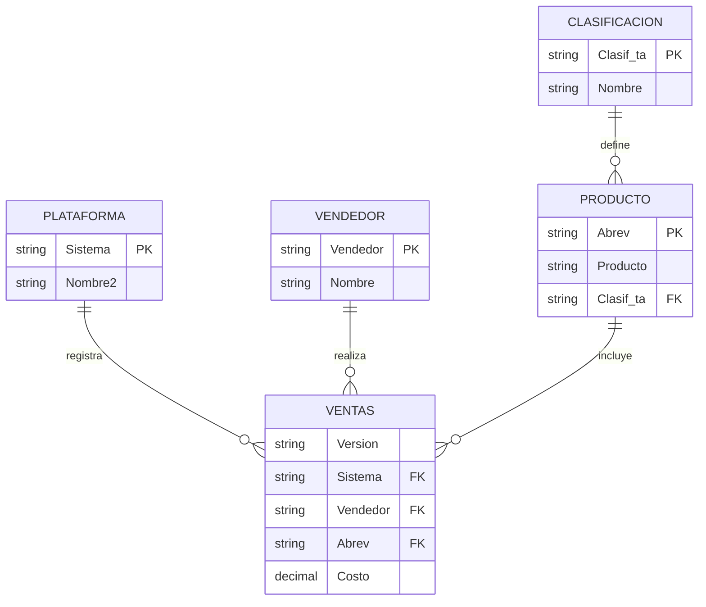

# Normalización paso a paso  
Ver también: [05 - Normalización de Bases de Datos](05-normalizacion.md)
Archivo fuente (crudo): [05.1-normalizacion.xlsx](../05-material-de-apoyo/05.1-normalizacion.xlsx) — no modificar
Proceso completo desde la tabla original hasta el modelo en 3FN

Este documento presenta un recorrido completo por el proceso de normalización de una tabla que contiene información de productos, plataformas, vendedores y costos. El objetivo es partir de una tabla desordenada, identificar dependencias funcionales, separar entidades y llegar a un modelo totalmente normalizado en 3FN.

---

## 0. Introducción

La normalización es el proceso mediante el cual se reorganizan los datos para eliminar redundancias, dependencias incorrectas y anomalías de actualización. En este documento se parte de una tabla inicial con múltiples dependencias funcionales mezcladas y se avanza paso a paso hasta obtener un modelo relacional limpio, consistente y normalizado.

---

## 1. Tabla original (Paso 1)

La tabla inicial contiene atributos de productos, plataformas, vendedores, clasificaciones y dependencias funcionales escritas como texto.

### Tabla original

| Nombre | Versión | Sistema | Vendedor | Clasif_ta | Nombre2 | Abrev | Costo | Producto |
|---|---:|---|---|---|---|---|---:|---|
| Programación | 1 | DO | Kassem | PRG | Windows | CP | 130.79 | Compilador |
| Programación | 1 | NI | Kassem | PRG | Unix | CP | 133.14 | Compilador |
| Programación | 2 | NI | Kassem | PRG | Unix | CP | 136.83 | Compilador |
| Programación | 1 | NI | Olinto | PRG | Unix | PB | 133.94 | Poderus |
| Programación | 1 | DO | Olinto | PRG | Windows | PB | 135.66 | Poderus |
| Programación | 1 | IN | Olinto | PRG | Linux | PB | 141.25 | Poderus |
| Programación | 1.5 | DO | Olinto | PRG | Windows | PB | 150.29 | Poderus |
| Programación | 2 | NI | Olinto | PRG | Unix | PB | 151.42 | Poderus |
| Programación | 1 | IN | Heberto | PRG | Linux | PD | 127.73 | Diseñador |
| Programación | 1 | LA | Heberto | PRG | Solaris | PD | 132.21 | Diseñador |
| Programación | 1 | DO | Heberto | PRG | Windows | PD | 133.34 | Diseñador |
| Escritorio | 1 | DO | Olinto | SC | Windows | PE | 124.13 | Persuasión |
| Escritorio | 1 | NI | Olinto | SC | Unix | PE | 127.69 | Persuasión |
| Escritorio | 1 | LA | Olinto | SC | Solaris | PE | 133.44 | Persuasión |
| Escritorio | 1.5 | NI | Olinto | SC | Unix | PE | 134.47 | Persuasión |
| Escritorio | 1 | LA | Kassem | SC | Solaris | RD | 136.73 | Palabras |
| Escritorio | 1 | IN | Kassem | SC | Linux | RD | 160.46 | Palabras |
| Escritorio | 1.5 | LA | Kassem | SC | Solaris | RD | 159.33 | Palabras |
| Escritorio | 1 | DO | Heberto | SC | Windows | XC | 125.43 | Cálculo 21 |
| Escritorio | 1 | LA | Heberto | SC | Solaris | XC | 150.39 | Cálculo 21 |
| Escritorio | 1.2 | DO | Heberto | SC | Windows | XC | 136.93 | Cálculo 21 |

### Observaciones iniciales

La tabla mezcla:

- Datos reales.  
- Dependencias funcionales incrustadas como texto.  
- Dependencias bidireccionales entre atributos.

Esto impide que la tabla esté normalizada.

### Dependencias funcionales detectadas

1. Abrev ↔ Producto  
2. Sistema ↔ Nombre2  
3. Clasif_ta ↔ Nombre  

---

## 2. Transformaciones I — Separación de dependencias bidireccionales

Se extraen las entidades que presentan equivalencias entre atributos.

### Entidad Producto

| Abrev | Producto |
|---|---|
| CP | Compilador |
| PB | Poderus |
| PD | Diseñador |
| PE | Persuasión |
| RD | Palabras |
| XC | Cálculo 21 |

### Entidad Plataforma

| Sistema | Nombre2 |
|---|---|
| DO | Windows |
| IN | Linux |
| LA | Solaris |
| NI | Unix |

### Entidad Clasificación

| Clasif_ta | Nombre |
|---|---|
| PRG | Programación |
| SC | Escritorio |

Estas tablas eliminan las dependencias bidireccionales y reducen redundancia.

---

## 3. Transformaciones II — Limpieza de la tabla de hechos

Se toma la tabla original y se eliminan dependencias que no pertenecen al dominio (ejemplos de cédula).

### Tabla depurada

| Versión | Sistema | Vendedor | Clasif_ta | Abrev | Costo |
|---|---|---|---|---|---:|
| 1 | DO | Kassem | PRG | CP | 130.79 |
| 1 | NI | Kassem | PRG | CP | 133.14 |
| 2 | NI | Kassem | PRG | CP | 136.83 |
| 1 | NI | Olinto | PRG | PB | 133.94 |
| 1 | DO | Olinto | PRG | PB | 135.66 |
| 1 | IN | Olinto | PRG | PB | 141.25 |
| 1.5 | DO | Olinto | PRG | PB | 150.29 |
| 2 | NI | Olinto | PRG | PB | 151.42 |
| 1 | IN | Heberto | PRG | PD | 127.73 |
| 1 | LA | Heberto | PRG | PD | 132.21 |
| 1 | DO | Heberto | PRG | PD | 133.34 |
| 1 | DO | Olinto | SC | PE | 124.13 |
| 1 | NI | Olinto | SC | PE | 127.69 |
| 1 | LA | Olinto | SC | PE | 133.44 |
| 1.5 | NI | Olinto | SC | PE | 134.47 |
| 1 | LA | Kassem | SC | RD | 136.73 |
| 1.5 | LA | Kassem | SC | RD | 159.33 |
| 1 | IN | Kassem | SC | RD | 160.46 |
| 1 | DO | Heberto | SC | XC | 125.43 |
| 1.2 | DO | Heberto | SC | XC | 136.93 |
| 1 | LA | Heberto | SC | XC | 150.39 |

### Dependencias funcionales reales

Abrev → Clasif_ta  
Abrev → Producto  
Sistema → Nombre2  
Clasif_ta → Nombre  

### Clave candidata inicial

(Versión, Sistema, Abrev)

---

## 4. Transformaciones III — Confirmación de dependencias

Se confirma que Abrev determina completamente la clasificación del producto.

### Tabla de clasificación derivada

| Abrev | Clasif_ta | Producto |
|---|---|---|
| CP | PRG | Compilador |
| PB | PRG | Poderus |
| PD | PRG | Diseñador |
| PE | SC | Persuasión |
| RD | SC | Palabras |
| XC | SC | Cálculo 21 |

### Conclusión

Abrev → (Clasif_ta, Producto)

Por tanto, Clasif_ta debe eliminarse de la tabla de hechos, porque es derivable.

---

## 5. Transformaciones IV — Tabla final “Ventas”

Haremos una transformación adicional, que aunque no es requerida, sirve para ilustrar mejoras. En este caso, asignaremos un código a cada vendedor 

| vendedor | Nombre |
|---|---|
| 1 | Kassem |
| 2 | Olinto |
|3  | Heberto|

La tabla final queda completamente normalizada.

| Versión | Sistema | Vendedor | Abrev | Costo |
|---|---|---:|---|---:|
| 1 | DO | 1 | CP | 130.79 |
| 1 | NI | 1 | CP | 133.14 |
| 2 | NI | 1 | CP | 136.83 |
| 1 | NI | 2 | PB | 133.94 |
| 1 | DO | 2 | PB | 135.66 |
| 1 | IN | 2 | PB | 141.25 |
| 1.5 | DO | 2 | PB | 150.29 |
| 2 | NI | 2 | PB | 151.42 |
| 1 | IN | 3 | PD | 127.73 |
| 1 | LA | 3 | PD | 132.21 |
| 1 | DO | 3 | PD | 133.34 |
| 1 | DO | 2 | PE | 124.13 |
| 1 | NI | 2 | PE | 127.69 |
| 1 | LA | 2 | PE | 133.44 |
| 1.5 | NI | 2 | PE | 134.47 |
| 1 | LA | 1 | RD | 136.73 |
| 1.5 | LA | 1 | RD | 159.33 |
| 1 | IN | 1 | RD | 160.46 |
| 1 | DO | 3 | XC | 125.43 |
| 1.2 | DO | 3 | XC | 136.93 |
| 1 | LA | 3 | XC | 150.39 |

### Verificación de formas normales

1FN: todos los valores son atómicos  
2FN: no hay dependencias parciales  
3FN: no hay dependencias transitivas  

### Clave primaria final

(Versión, Sistema, Abrev)

---

## 6. Modelo normalizado

### Entidad Producto

Producto(Abrev PK, Producto, Clasif_ta FK)

### Entidad Clasificación

Clasificación(Clasif_ta PK, Nombre)

### Entidad Plataforma

Plataforma(Sistema PK, Nombre2)

### Entidad Vendedor

Vendedor(Vendedor PK, Nombre)

### Entidad Ventas (Hechos)

Ventas(  
  Versión,  
  Sistema FK → Plataforma(Sistema),  
  Vendedor FK → Vendedor(Vendedor),  
  Abrev FK → Producto(Abrev),  
  Costo,  
  PK (Versión, Sistema, Abrev)  
)

---

## 7. Diagrama entidad–relación final

### Modelo conceptual (ER)

---

## 8. Conclusiones

- Se eliminaron dependencias bidireccionales.  
- Se separaron entidades independientes.   
- Se confirmó que Abrev determina Clasif_ta y Producto.  
- La tabla final “Ventas” quedó completamente normalizada en 3FN.  
- El modelo resultante es limpio, consistente y listo para implementación en SQL.

